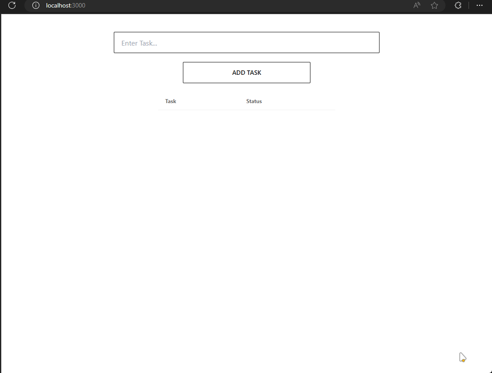

## A simple TODO app using MERN stact

### Dependencies

The following dependencies are required to run this project:

* Node.js
* pnpm
* react vite
* express
* mongodb

```bash
cd frontend
pnpm dev --port 3000

cd backend
pnpm dev
```

### Demo
